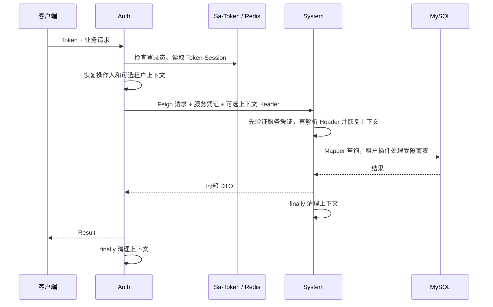

<!--
@author niuren
@date 2026-10-05 22:54
-->

# 身份与租户上下文契约

本文说明当前身份与租户上下文的来源、服务凭证校验和仍需完成的部署边界。部署网络限制需要在目标环境单独验证。

## 1. 身份 ID

| 名称 | 来源 | 含义 |
| --- | --- | --- |
| userId | `na_user.id` | 全局用户身份，Sa-Token 的 loginId |
| tenantId | `na_tenant.id` | 当前请求操作的租户 |
| memberId | `na_tenant_member.id` | 用户加入某租户的成员关系 |

同一个全局用户可以加入多个租户，在各租户中的 `memberId` 不同。`userId`、`tenantId`、`memberId` 不可互换。

当前数据库实体使用 `Long` 与 MyBatis-Plus `ASSIGN_ID`；状态由各实体对应枚举映射。用户和租户是平台级数据，成员关系属于租户数据。

## 2. Token-Session

当前仅 Auth 使用 Sa-Token 与其 Redis 持久化适配器，`StpUtil.login(userId)` 创建登录态。租户选择属于当前 Token：

| key | 当前写入类型 | 含义 |
| --- | --- | --- |
| currentTenantId | Long | 已通过成员关系检查的当前租户 |
| currentMemberId | Long | 当前用户在该租户中的成员关系 ID |

key 定义在 `AuthSessionConstants`。新登录不会主动写入以上字段；客户端必须完成租户选择。

没有保存角色或权限快照。`currentMemberId` 目前只在切换时保存，不作为后续成员状态仍然有效的证明；当前租户接口会重新向 System 查询关系。

开发配置允许同一用户并发登录，`is-share = false`，分别选择租户的前提是使用不同 Token。不要把租户选择存入共享账号会话或用全局用户 ID 替代 Token 隔离。

## 3. 当前请求链路

服务凭证校验与用户授权是两步：System 先确认请求携带正确的共享服务凭证，再由业务服务检查用户、成员和租户是否允许访问。登录前查询认证信息同样需要服务凭证，但此时没有用户和租户上下文。

### Auth

`AuthRequestContextFilter` 仅在 `StpUtil.isLogin()` 成立时恢复 `OperatorContextHolder`，并从 Token-Session 恢复当前租户。它不直接采用浏览器提交的 `X-Nexus-*` 作为身份，也不强制所有接口登录。当前受保护接口使用 `StpUtil.checkLogin()`。

`NexusFeignContextInterceptor` 先移除模板中已有的三个内部 Header，再为目标服务名为 `nexusauth-system` 的请求注入服务凭证，并从上述上下文生成用户与租户 Header。不存在的上下文不发送；其他目标或无法确定目标的请求不注入这些字段，避免把 System 的凭证发送给其他服务。

### System

`SystemRequestContextFilter` 在当前所有普通 HTTP 请求中先验证服务凭证，缺失、错误或重复时返回 HTTP 401，不进入 Controller。验证通过后，才读取用户与租户 Header：已提供的 ID 必须是可表示的正 Long，同名 Header 不能重复；非法 ID 或租户存在而用户缺失时返回 HTTP 400。

过滤器允许上下文缺省，以支持登录前的认证信息查询。需要用户或租户的业务入口仍必须自行要求相应上下文，并检查实际访问资格；持有服务凭证不等于拥有任意用户或租户的业务权限。

System 在处理开始时防御性清理旧上下文；两个服务都在 `finally` 中清理操作人与租户 ThreadLocal。线程池、异步任务及响应式链路不能假定这些值自动传播。

## 4. 内部 Header

| Header | 当前发送方 | 当前使用方 | 说明 |
| --- | --- | --- | --- |
| X-Nexus-Service-Token | Auth Feign 拦截器 | System 过滤器 | 独立于用户登录 Token 的共享服务凭证 |
| X-Nexus-User-Id | Auth Feign 拦截器 | System 过滤器 | 当前操作用户，可在登录前缺省 |
| X-Nexus-Tenant-Id | Auth Feign 拦截器 | System 过滤器 | 当前已选择租户，可缺省 |

Header 常量位于 `NexusHeaderConstants`。用户和租户 Header 只传递上下文，服务凭证用于校验调用服务；不得把“数值能解析”解释为“用户已获授权”。共享凭证只能证明持有该凭证，不能区分持有它的多个服务，因此只向已确定的调用方分发。

当前 Gateway 仅路由 `/auth/**` 和 `/system/**`，没有内部 Header 清理或用户身份重建功能，也没有 `/internal/**` 路由。

## 5. 数据隔离与关系校验

System 注册 `TenantLineInnerInterceptor`，从 `TenantContextHolder.requireTenantId()` 获取租户。`na_user`、`na_tenant`、`na_resource` 是当前平台级忽略表，资源定义不含租户字段，授权关系仍参与租户隔离；访问其他受隔离表缺少上下文时应拒绝，不能回退到默认租户。

MyBatis-Plus 插件负责 SQL 隔离，不等同于用户具有访问资格，也不验证关联双方属于同一租户。多步授权写入仍须在 Service 中检查成员、角色及资源的业务归属，并定义事务边界。

`TenantMemberMapper.selectByUserIdCrossTenant` 是用于查询当前用户全部成员关系的例外。`getUserTenants(userId)` 在调用 Mapper 前校验当前操作人存在且与参数一致，不能借该方法查询其他用户的成员关系。

当前租户访问服务检查成员与租户的状态，尚未按 `expireTime` 单独检查到期。

## 6. 配置与尚未完成的边界

当前 Auth 的 dev/prod Redis 数据库编号都是 1，System 都是 0。System 尚未使用 Sa-Token，不能把其数据库 0 当成 Auth 登录态的共享存储；如果以后需要直接校验同一 Token，应先明确 Sa-Token 存储、Token 名和序列化等配置。

`nexusauth.internal.system-token` 必须在 Auth 与 System 配置为相同值，由 `InternalServiceCredential` 在构造时校验。当前格式为 43～128 位的字母、数字、下划线或连字符；上线时使用外部注入的随机凭证，不使用用户 Token，也不记录到普通日志。当前 dev 配置使用 `NEXUSAUTH_SYSTEM_INTERNAL_TOKEN` 环境变量并含本地默认值；prod 配置尚未声明该属性，部署前必须补齐，缺失或非法配置会导致服务启动失败。

以下是尚未实现或未验证的事项，后续安全入口和权限功能交付时必须有明确实现及验证结果：

- 外部请求内部 Header 的清理，以及网关根据真实登录态生成可信上下文。
- dev/prod 的 Sa-Token 参数一致性。当前显式配置只在 Auth dev 文件中。
- 已登录用户、成员或租户被停用后的各接口失效规则。当前 `/auth/me` 只检查登录态。
- RBAC 资源管理权限、方法注解实际执行、无权限异常和跨租户操作验收。

System 需限制在可信内部网络中使用，并为生产调用配置安全传输和凭证管理；共享服务凭证不会自动提供这些部署能力。部署的网络限制仍待验证。
